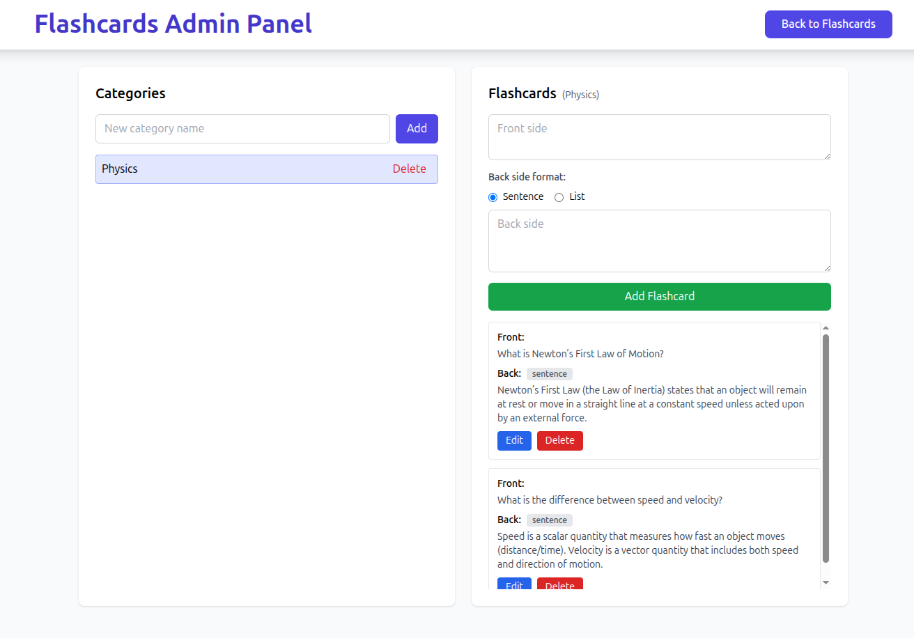
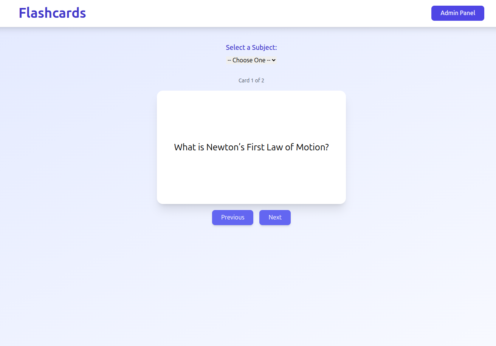

# Flashcard Application

## Overview

This is a lightweight flashcard study app built with React (Vite + TailwindCSS) 
and a SQLite database with Node/Express API.

The app provides a simple study interface (flip front/back) and an admin UI 
for managing categories and flashcards.

### Tech stack

- Frontend: React + Vite, TailwindCSS for styling
- Backend: Node.js + Express.js
- Database: SQLite (with better-sqlite3)

## Running The Application

The following command will run both the backend and frontend:

```
npm run dev:full
```

This will start:
- Backend API server on port 3001
- Frontend dev server on port 3000

### Running Separately

Backend only:
```
npm run server
```

Frontend only:
```
npm run dev
```

### Seeding the Database

To quickly populate your database with test data, you can use the seeding script:

```bash
npm run db:seed
```

This reads from `/server/seed-data.json` and populates the database. The seed script:
- Creates categories (subjects) if they don't exist
- Adds flashcards, skipping duplicates
- Can be run multiple times safely (idempotent)

To start fresh:
```bash
npm run db:clean  # Remove all data
npm run db:seed   # Add seed data
```

The seed data format in `seed-data.json`:
```json
{
  "subjects": [
    {
      "name": "Category Name",
      "cards": [
        {
          "front": "Question",
          "back": "Answer",
          "format": "sentence"
        }
      ]
    }
  ]
}
```

## Database Schema

The SQLite database consists of two main tables:

**Categories**
- `id` - Auto-increment primary key
- `name` - Unique category name
- `created_at` - Timestamp
- `updated_at` - Timestamp

**Flashcards**
- `id` - Auto-increment primary key
- `category_id` - Foreign key to categories (cascade delete)
- `front` - Question/front of card
- `back` - Answer/back of card
- `back_format` - Format type: 'sentence', 'list', or 'code'
- `code_language` - Programming language (for code format)
- `created_at` - Timestamp
- `updated_at` - Timestamp

## User Interfaces

### Admin Interface


### Flashcard Front


### Flashcard Back

