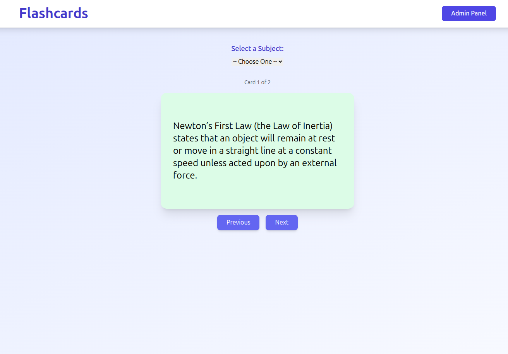

# Flashcard Application

This is a lightweight flashcard study app built with React (Vite + TailwindCSS) 
and a SQLite database with Node/Express API.

The app provides a simple study interface (flip front/back) and an admin UI 
for managing categories and flashcards.

## Overview

### Tech stack
- Frontend: React + Vite, TailwindCSS for styling
- Backend: Node.js + Express.js
- Database: SQLite (with better-sqlite3)

## Running The Application

The following command will run both the backend and frontend:

```
npm run dev:full
```

This will start:
- Backend API server on port 3001
- Frontend dev server on port 5173 (default Vite port)

### Running Separately

Backend only:
```
npm run server
```

Frontend only:
```
npm run dev
```

## Database Migration

If you're migrating from the old `data.json` format to SQLite, run:

```
npm run migrate
```

This will:
- Read all categories and flashcards from `/public/data.json`
- Import them into the SQLite database at `/server/flashcards.sqlite`
- Skip duplicates if the script is run multiple times
- Preserve existing data in the database

### Database Scripts

- `npm run migrate` - Migrate data from data.json to SQLite
- `npm run export:json` - Export SQLite database to JSON format (if the script exists)
- `npm run import:json` - Import JSON data to SQLite (if the script exists)

## Database Schema

The SQLite database consists of two main tables:

**Categories**
- `id` - Auto-increment primary key
- `name` - Unique category name
- `created_at` - Timestamp
- `updated_at` - Timestamp

**Flashcards**
- `id` - Auto-increment primary key
- `category_id` - Foreign key to categories (cascade delete)
- `front` - Question/front of card
- `back` - Answer/back of card
- `back_format` - Format type: 'sentence', 'list', or 'code'
- `code_language` - Programming language (for code format)
- `created_at` - Timestamp
- `updated_at` - Timestamp

